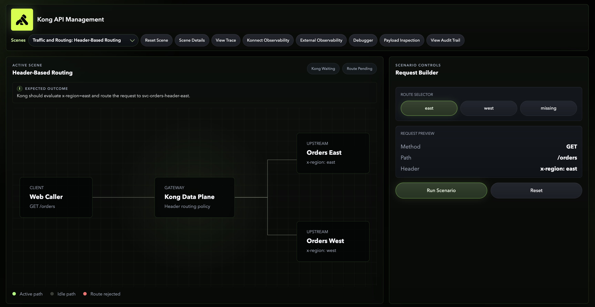
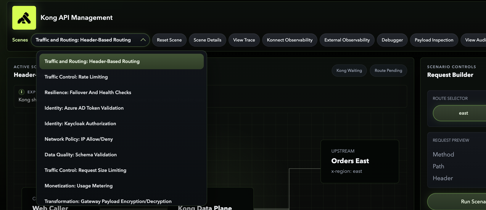
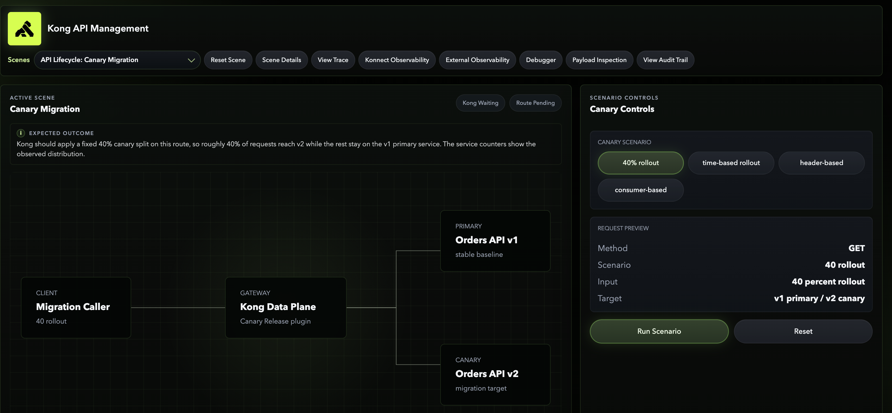
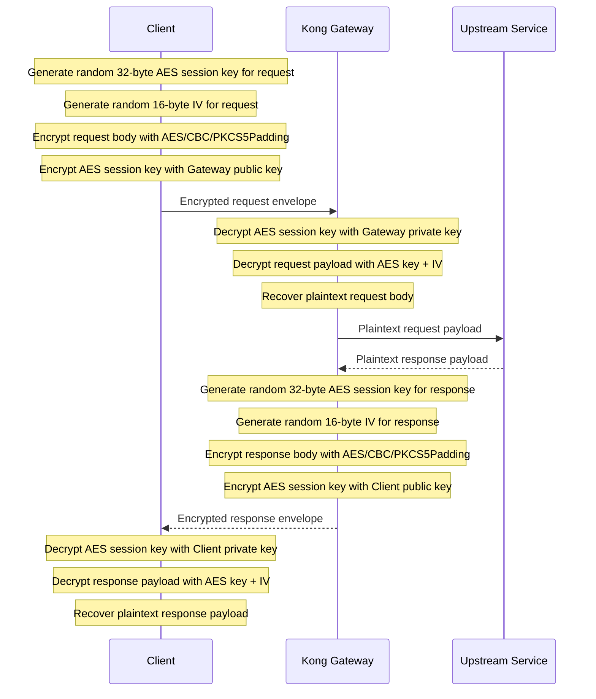

# Konnect API Demo

This project is a local demo environment for **Konnect hybrid** scenarios built around a local Kong data plane, Terraform-provisioned Kong entities, mock upstreams, and a scene-based UI.

## Table Of Contents

- [Prerequisites](#prerequisites)
  - [Konnect](#konnect)
  - [Local Tooling](#local-tooling)
  - [Local Files](#local-files)
- [Current Scope](#current-scope)
- [Demo Overview](#demo-overview)
- [Provisioning Model](#provisioning-model)
- [Local Runtime Shape](#local-runtime-shape)
- [Mock Service Reference](#mock-service-reference)
- [Observability Stack](#observability-stack)
  - [Latency Fields](#latency-fields)
- [Payload Encryption Flow](#payload-encryption-flow)
  - [High-Level Model](#high-level-model)
  - [Request Decryption At Kong](#request-decryption-at-kong)
  - [Response Encryption At Kong](#response-encryption-at-kong)
  - [End-To-End Diagram](#end-to-end-diagram)
- [Configuration](#configuration)
  - [Environment Variables](#environment-variables)
  - [Certificates](#certificates)
- [Run](#run)
- [Demo Scenes](#demo-scenes)
  - [Traffic And Routing](#traffic-and-routing)
  - [Traffic Control](#traffic-control)
  - [Transformation](#transformation)
  - [Resilience](#resilience)
  - [Identity](#identity)
  - [Network Policy](#network-policy)
  - [Data Quality](#data-quality)
  - [Security](#security)
  - [Transport Security](#transport-security)
  - [API Lifecycle](#api-lifecycle)
- [UI Actions](#ui-actions)
- [Konnect Audit Trail](#konnect-audit-trail)
- [Terraform Layout](#terraform-layout)
- [Repository Notes](#repository-notes)
- [References](#references)

## Prerequisites

### Konnect

- An existing Konnect control plane
- A valid Konnect personal access token
- Konnect hybrid control plane bootstrap details for the local data plane
- Once the start up script runs - do set up Metering and Billing as per 

### Local Tooling

- Docker Desktop
- Terraform
- Python 3
- Git
- GitHub CLI (`gh`) if you want to create and push the repo from the command line

### Local Files

- A local `.env` file populated from `.env-example`
- Konnect hybrid client certificate and private key under `certs/`

## Current Scope

- Header-based routing
- Service-level and consumer-level rate limiting
- Weighted load balancing
- Failover and circuit-breaker style health-check behavior
- Azure AD token validation with Kong `openid-connect`
- Keycloak role-based authorization with Kong `openid-connect`
- IP allow/deny enforcement
- Request schema validation
- Request size limiting
- Request decryption and response encryption with a custom Kong plugin
- Injection protection across query params, body, and headers
- HTTP blocked and HTTP-to-HTTPS redirect transport enforcement
- Versioned API routing with path-based and header-based matching
- Canary migration with percentage, time-based, header override, and consumer-aware flows
- API deprecation with deprecation headers and sunset enforcement
- Grafana, Loki, Tempo, and OpenTelemetry Collector for request log and trace visibility
- Konnect audit log webhook ingestion through ngrok into a dedicated Grafana audit dashboard

## Demo Overview

The images below give a quick overview of the demo experience before you go into the detailed scene-by-scene sections.

### Overview 1



### Overview 2



### Overview 3



## Provisioning Model

All Kong / Konnect entities are managed with Terraform.

That includes:

- services
- routes
- plugins
- consumers
- credentials
- upstreams
- targets

Keycloak itself is bootstrapped locally by a script. It is not managed by Terraform in this repo.

## Local Runtime Shape

The local runtime uses:

- `kong-dp`
- `demo-ui`
- `grafana`
- `loki`
- `tempo`
- `otel-collector`
- `orders-east`
- `orders-west`
- `orders-instance-1`
- `orders-instance-2`
- `keycloak`

There is no local Kong control plane or local Postgres in this repo.

## Mock Service Reference

For a scene-organized list of the running mock services, their local ports, and direct `curl` examples that show input and output shapes, see:

- [Mock Services Reference](mock-services-reference.md)

## Observability Stack

The local observability path is:

- Kong `opentelemetry` plugin (global)
- Kong `post-function` plugin for request/response body capture and request ID to trace correlation
- Konnect audit log webhook -> local audit receiver -> Loki
- OpenTelemetry Collector
- Loki for logs
- Tempo for traces
- Grafana for dashboards and trace navigation

The Grafana dashboard includes:

- a request table with request ID, status, consumer, service, route, and latency columns
- a request/response lookup query pane by request ID
- a consumer-to-service access chart
- total traffic over time
- request volume breakdown by service, route, and consumer
- latency breakdown over time
- error, auth failure, and rate-limit charts
- security and policy block charts
- versioned API traffic over time
- canary traffic distribution
- deprecation and sunset activity
- slowest service, route, and consumer charts

### Latency Fields

The latency fields shown in Grafana come directly from Kong's serialized request metadata and are exported through the global `opentelemetry` plugin.

- `end_to_end_latency_ms`
  - sourced from `kong.log.serialize().latencies.request`
  - total request duration as observed by Kong, from request receipt to response completion

- `kong_latency_ms`
  - sourced from `kong.log.serialize().latencies.kong`
  - time spent inside Kong itself for routing, plugin execution, and gateway processing

- `upstream_latency_ms`
  - sourced from `kong.log.serialize().latencies.proxy`
  - time Kong spent waiting on the upstream/backend response

In practical terms:

- `end_to_end_latency_ms` is the customer-facing total
- `kong_latency_ms` isolates gateway overhead
- `upstream_latency_ms` isolates backend response time

## Payload Encryption Flow

This demo includes a custom Kong plugin that decrypts inbound request payloads at the gateway and encrypts outbound response payloads before they leave the gateway.

### High-Level Model

The crypto model is a hybrid of asymmetric and symmetric encryption.

- **AES is symmetric**
  - the same secret key is used to encrypt and decrypt
  - in this flow, AES is used for the actual request and response payload bodies
  - the payload algorithm is `AES/CBC/PKCS5Padding`

- **RSA is asymmetric**
  - one key encrypts and the matching paired key decrypts
  - in this flow, RSA is used only to protect the short-lived AES session key
  - request path:
    - client encrypts the AES session key with the **gateway public key**
    - Kong decrypts that AES session key with the **gateway private key**
  - response path:
    - Kong encrypts a fresh AES session key with the **client public key**
    - client decrypts that AES session key with the **client private key**

This means:

- **symmetric crypto** protects the bulk payload efficiently
- **asymmetric crypto** protects the short-lived session key so it can be transferred securely

Each encrypted message is sent as an envelope with:

- `encryptedSessionKey`
- `iv`
- `encryptedPayload`
- `algorithm`
- optional key metadata
- optional signature or HMAC

### Request Decryption At Kong

1. Client generates a random **32-byte AES session key**
   - used only for this request payload encryption
2. Client generates a random **16-byte IV**
3. Client encrypts the request payload using:
   - request body
   - AES session key
   - IV
   - algorithm: `AES/CBC/PKCS5Padding`
   - this generates:
     - **Encrypted Payload**
4. Client encrypts the AES session key using the **Gateway Public Key**
   - purpose: securely transfer the AES session key to the gateway
   - this generates:
     - **Encrypted Session Key**
5. Client sends the following to the gateway:
   - encrypted session key
   - IV
   - encrypted payload
   - optional key identifier / metadata
   - optional digital signature / HMAC
6. Gateway decrypts the encrypted AES session key using the **Gateway Private Key**
   - private key may be retrieved from:
     - keystore
     - HSM
     - Vault/KMS
   - keystore password is used to access private key material
   - result:
     - original AES session key recovered
7. Gateway decrypts the encrypted payload using:
   - decrypted AES session key
   - IV
   - algorithm: `AES/CBC/PKCS5Padding`
8. Gateway obtains the original plaintext request payload
9. Gateway forwards the decrypted payload to the upstream service

### Response Encryption At Kong

1. Gateway generates a random **32-byte AES session key**
   - used only for this response payload encryption
   - example: AES-256 session key
2. Encryption algorithm used for payload encryption:
   - `AES/CBC/PKCS5Padding`
3. Gateway generates a random **16-byte IV**
   - required for AES-CBC encryption
   - must be unique per encryption operation
4. Gateway encrypts the response payload using:
   - response body
   - AES session key
   - IV
   - algorithm: `AES/CBC/PKCS5Padding`
   - this generates:
     - **Encrypted Payload**
5. Gateway encrypts the AES session key using the **Client Public Key**
   - purpose: securely transfer the AES session key to the client
   - algorithm typically used:
     - RSA
     - `RSA/ECB/OAEPWithSHA-256AndMGF1Padding` (recommended)
     - or `PKCS1Padding` (older approach)
   - this generates:
     - **Encrypted Session Key**
6. Gateway sends the following to the client:
   - encrypted session key
   - IV
   - encrypted payload
   - optional key identifier / metadata
   - optional digital signature / HMAC
7. Client decrypts the encrypted AES session key using the **Client Private Key**
   - result:
     - original AES session key recovered
8. Client decrypts the encrypted payload using:
   - decrypted AES session key
   - IV
   - algorithm: `AES/CBC/PKCS5Padding`
9. Client obtains the original plaintext response payload

### End-To-End Diagram



The practical role of each crypto element is:

- **Gateway public key**
  - lets the client protect the request session key so only Kong can open it

- **Gateway private key**
  - lets Kong recover the request session key and decrypt the request payload

- **Client public key**
  - lets Kong protect the response session key so only the client can open it

- **Client private key**
  - lets the client recover the response session key and decrypt the response payload

- **AES session key**
  - encrypts the actual request or response body efficiently
  - a fresh session key is generated per request or response operation

- **IV**
  - ensures the same plaintext encrypted twice does not produce the same ciphertext
  - must be unique for each AES-CBC encryption operation

- **`AES/CBC/PKCS5Padding`**
  - the symmetric payload encryption algorithm used in this demo

- **RSA**
  - the asymmetric key transport mechanism used to protect the short-lived AES session key

### Current Implementation Notes

The section above describes the intended protocol flow. The current repo implementation uses the following concrete runtime choices:

- **Gateway-side crypto execution**
  - request decryption and response encryption are performed inside the custom Kong plugin
  - the plugin uses mounted key material from the local container filesystem

- **Key material location**
  - gateway private key: mounted PEM file
  - gateway public key: mounted PEM file
  - client public key: mounted PEM file
  - client private key: used by the local demo client path to decrypt gateway responses for display

- **Private key protection**
  - the gateway private key is loaded with a passphrase provided through an environment variable
  - this demo does not currently integrate with an external HSM, Vault, or KMS

- **AES implementation detail**
  - payload encryption uses OpenSSL `aes-256-cbc`
  - operationally, this aligns with what Java and most application teams refer to as `AES/CBC/PKCS5Padding`

- **RSA wrapping detail**
  - the AES session key is currently wrapped and unwrapped using the OpenSSL RSA path used by the plugin
  - this is the current implementation choice and should be treated as the runtime-specific detail, separate from the higher-level protocol explanation above

- **Integrity protection**
  - the current demo envelope does not yet add an HMAC or digital signature

- **Envelope fields**
  - the current envelope includes:
    - `encryptedSessionKey`
    - `iv`
    - `encryptedPayload`
    - `algorithm`

## Configuration

### Environment Variables

Copy `.env-example` to `.env` and populate the required values.

Important values include:

- `KONNECT_TOKEN`
- `KONNECT_CONTROL_PLANE_NAME`
- `KONNECT_CP_ID`
- `KONNECT_CLUSTER_CONTROL_PLANE`
- `KONNECT_CLUSTER_SERVER_NAME`
- `KONNECT_CLUSTER_TELEMETRY_ENDPOINT`
- `KONNECT_CLUSTER_TELEMETRY_SERVER_NAME`
- `GRAFANA_ADMIN_USER`
- `GRAFANA_ADMIN_PASSWORD`
- `KONNECT_AUDIT_SHARED_SECRET`
- Azure AD tenant, audience, and client credentials
- Keycloak bootstrap and demo client values

UI link behavior:

- `DEMO_LOGS_URL` sets the **Konnect Observability** button target.
- `DEMO_DEBUGGER_URL` sets the **Debugger** button target.
- Update those two values directly in `.env` if you want them to point at your own Konnect UI URLs.

### Certificates

Place the Konnect hybrid client materials in:

- `certs/public.cer`
- `certs/private.key`

The private key is intentionally excluded from source control.

## Run

Start the full demo stack and apply Konnect configuration:

```bash
./start-demo.sh
```

Stop the local stack and clean up local state:

```bash
./stop-demo.sh
```

When the stack is up, the main endpoints are:

- UI: `http://localhost:8080`
- Kong Proxy: `http://localhost:8000`
- Keycloak: `http://localhost:8081`
- Grafana: `http://localhost:3001`
- Loki: `http://localhost:3100`
- Tempo landing page: `http://localhost:3200`
- Tempo API: `http://localhost:3201`
- Audit Receiver: `http://localhost:8091/health`

## Demo Scenes

### Traffic And Routing

- Header-based routing using `x-region`
- Catch-all policy for missing routing input

### Traffic Control

- Anonymous service-level fixed-window rate limiting
- Consumer-based fixed-window rate limiting
- Request size limiting with:
  - `does not exceed limit`
  - `exceeds limit`

### Transformation

- Request decryption at Kong using the gateway private key
- Plaintext upstream processing after gateway-side decryption
- Response encryption at Kong using a fresh AES session key and the client public key
- The four payload stages are exported into Loki through the existing OTEL logging path:
  - encrypted request payload received by Kong
  - decrypted request payload forwarded upstream
  - plaintext response payload received back at Kong
  - encrypted response payload returned to the client

### Resilience

- 30:70 weighted load balancing
- Active and passive health checks
- Failover and recovery with container stop/start controls

### Identity

- Azure AD token validation
- Keycloak role-based authorization
- Kong consumer identification from token claims

Current claim mapping:

- Azure AD: `appid -> Kong Consumer custom_id`
- Keycloak: `azp -> Kong Consumer custom_id`

### Network Policy

- IP allow/deny enforcement on a dedicated route
- Demo source IP simulation through Kong's trusted forwarded-IP path
- Cases:
  - `allowed`
  - `denied`
  - `not listed`

### Data Quality

- Request validation on a dedicated route using Kong `request-validator`
- Cases:
  - `valid request`
  - `invalid body`
  - `invalid query param`
  - `invalid header / content-type`

### Security

- Injection protection using Kong `injection-protection`
- Subscenes:
  - `query params`
  - `body`
  - `headers`

### Transport Security

- Native Kong HTTPS-only route enforcement
- Cases:
  - `http blocked`
  - `http to https redirect`
- HTTP block returns `426`
- HTTP redirect returns `308` with a `Location` header

### API Lifecycle

- Versioned API routing
  - path-based:
    - `/api/v1/orders`
    - `/api/v2/orders`
  - header-based:
    - `/orders/version/header`
    - `x-api-version: v1 | v2`
- Canary migration
  - `40% rollout`
  - `time-based rollout`
  - `header-based`
  - `consumer-based`
- Deprecation
  - `deprecated v1`
  - `current v2`
  - `sunset enforced`

The lifecycle scenes use dedicated `orders-v1` and `orders-v2` upstreams so the response clearly shows which version handled the request.

## UI Actions

- `Scenes`
  - switches between the demo scenarios
- `Scene Details`
  - opens scene-specific Kong entity, route, service, and plugin details
- `Konnect Observability`
  - opens the Konnect analytics dashboard
- `External Observability`
  - opens the local Grafana dashboard for request/response observability
- `View Audit Trail`
  - opens the dedicated Grafana dashboard for Konnect control-plane audit events
- `View Trace`
  - opens Grafana Explore with a Tempo TraceQL query filtered by the current request ID when available
- `Payload Inspection`
  - opens Grafana Explore with a Loki query filtered by the current request ID when available

## Konnect Audit Trail

- Konnect sends audit events to a public HTTPS webhook exposed through ngrok.
- The webhook uses a random ngrok URL on each run.
- A local audit receiver validates the shared secret, normalizes the event, and writes it into Loki.
- Grafana provisions a separate dashboard named `Konnect Audit Trail`.
- The dashboard focuses on control-plane change events and answers:
  - who made the change
  - what type of Konnect resource was changed
  - which request path was called
  - when the change happened

The local components involved are:

- `konnect-audit-receiver`
- `ngrok`
- `loki`
- `grafana`

## Terraform Layout

Konnect Terraform is under:

- `terraform/konnect/versions.tf`
- `terraform/konnect/provider.tf`
- `terraform/konnect/header_routing.tf`
- `terraform/konnect/rate_limiting.tf`
- `terraform/konnect/resilience.tf`
- `terraform/konnect/identity.tf`
- `terraform/konnect/security_validation.tf`
- `terraform/konnect/transport_security.tf`
- `terraform/konnect/lifecycle.tf`
- `terraform/konnect/crypto_transform.tf`
- `terraform/konnect/observability.tf`

## Repository Notes

- Local markdown working notes are intentionally not part of the repository.
- `.env` is intentionally not part of the repository.
- Terraform state is intentionally not part of the repository.
- The private certificate key is intentionally not part of the repository.

## References

- Konnect overview: https://developer.konghq.com/konnect/
- Hybrid mode: https://developer.konghq.com/gateway/hybrid-mode/
- Konnect Terraform provider: https://registry.terraform.io/providers/Kong/konnect/latest
- Provider source: https://github.com/Kong/terraform-provider-konnect
